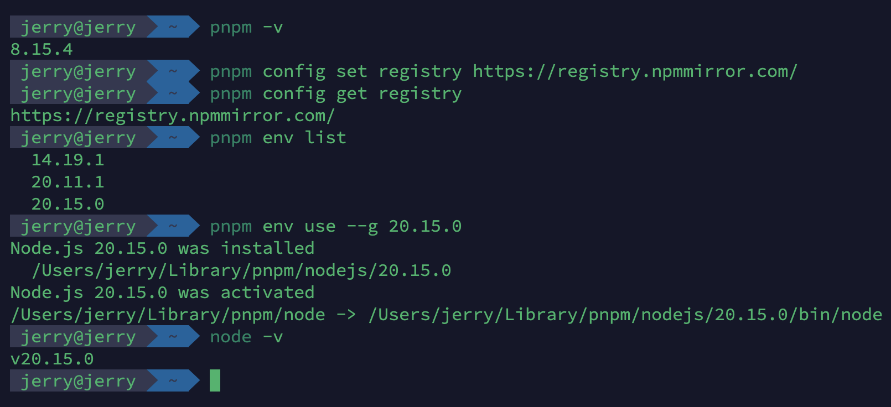
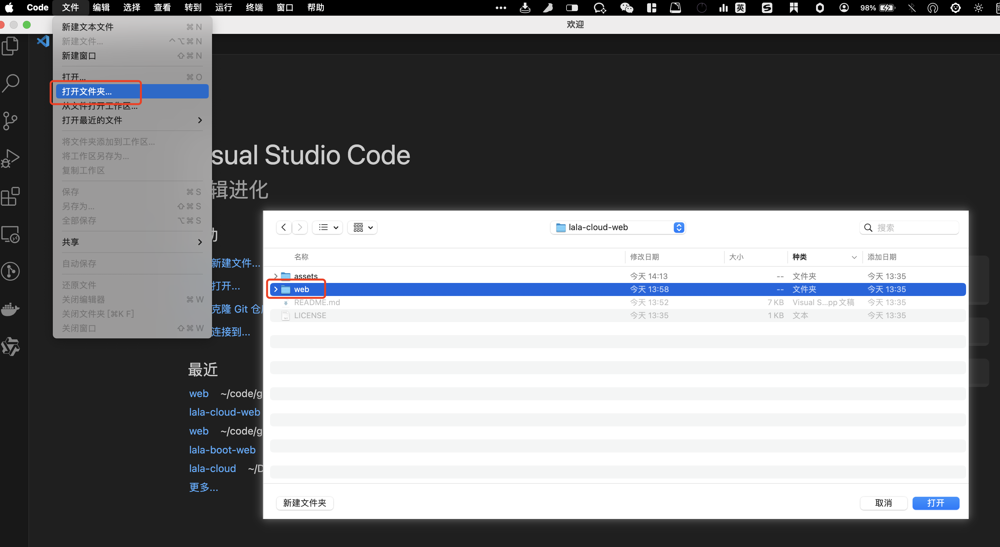
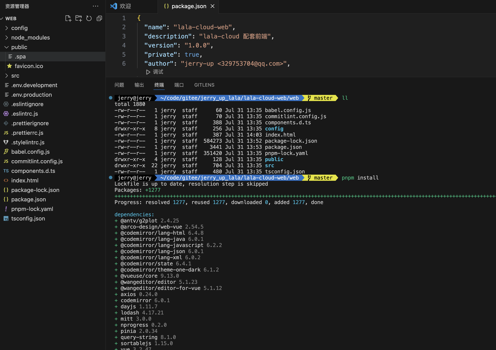
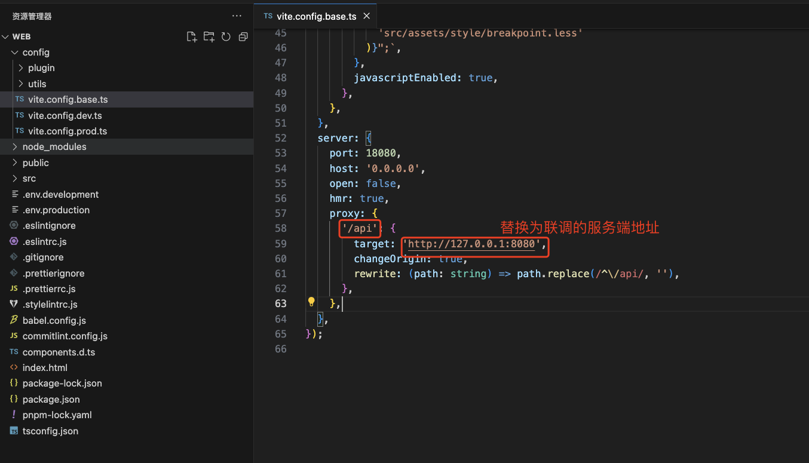
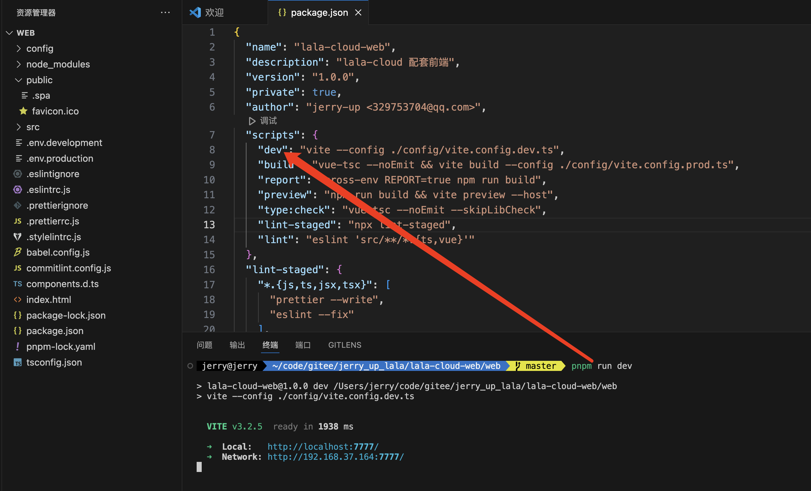
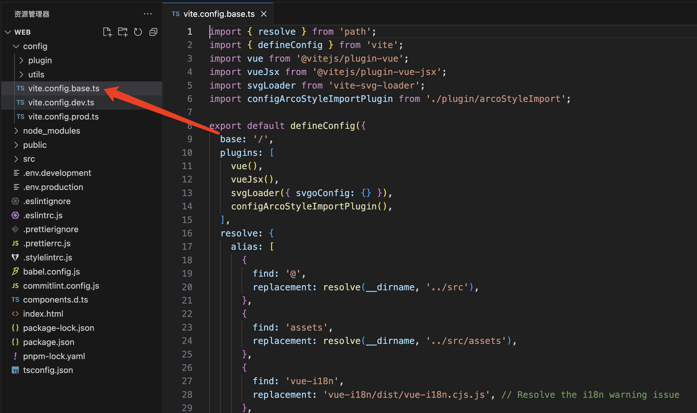
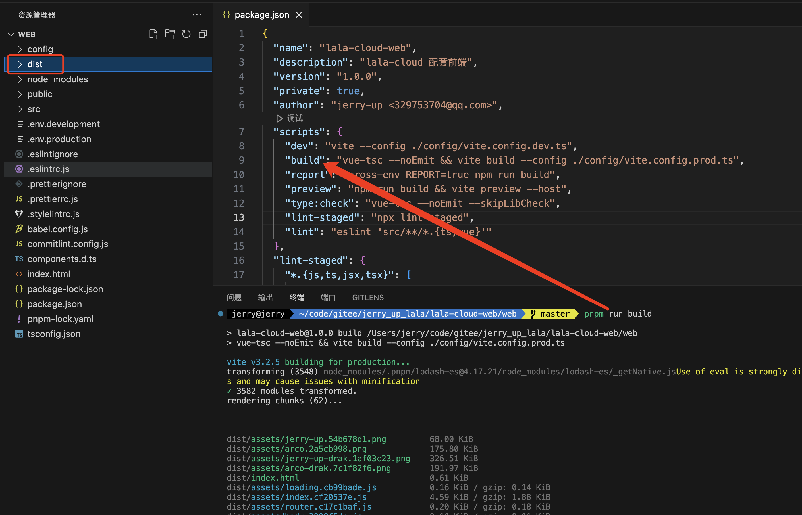
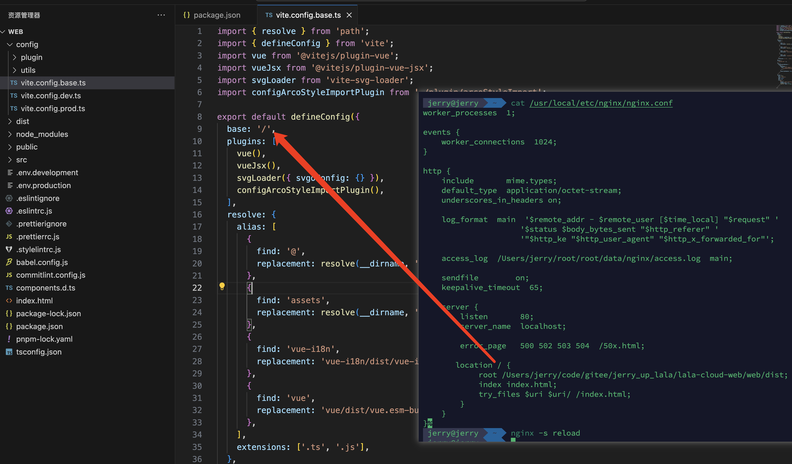

<!-- markdownlint-disable -->

<p align="center">
  
</p>
<h1 align="center">jerry-up · lala · lala-cloud-web</h1>
<h4 align="center">基于vue3，UI组件库使用arco-design-vue的管理后台，lala-cloud配套前端</h4>
<p align="center">
    
    <a href="./LICENSE" target="_blank">
        
    </a>
</p>
<p align="center">
    <a href="https://www.npmjs.com/package/vite/v/3.2.5" target="_blank">
        
    </a>
    <a href="https://www.npmjs.com/package/vue/v/3.2.40" target="_blank">
        
    </a>
    <a href="https://www.npmjs.com/package/@arco-design/web-vue/v/2.54.5" target="_blank">
        
    </a>
</p>

## 1. 项目简介
汇聚前端开发中常用的技术，功能，场景，提供使用样例。

| 项目                                                   | 仓库地址                                            | 说明                     |
| ------------------------------------------------------ | ------------------------ | ------------------------ |
| lala-cloud | [](https://gitee.com/jerry_up_lala/lala-cloud) [](https://github.com/jerry-up-lala/lala-cloud) | 配套服务端 |

## 2. 技术栈

| 框架  | 版本 | 说明 |
| ---- | ---- | ---- |
| [vue](https://cn.vuejs.org/) | [3.2.40](https://www.npmjs.com/package/vue/v/3.2.40) | 渐进式 JavaScript 框架 |
| [vue-router](https://router.vuejs.org/zh/) | [4.0.14](https://www.npmjs.com/package/vue-router/v/4.0.14) | Vue.js 的官方路由，为 Vue.js 提供富有表现力、可配置的、方便的路由 |
| [vue-i18n](https://vue-i18n.intlify.dev/) | [9.2.2](https://www.npmjs.com/package/vue-i18n/v/9.2.2)   | Vue.js的国际化插件 |
| [vite](https://cn.vitejs.dev/) | [3.2.5](https://www.npmjs.com/package/vite/v/3.2.5)  | 下一代的前端工具链，为开发提供极速响应 |
| [pinia](https://pinia.vuejs.org/zh/) | [2.0.23](https://www.npmjs.com/package/pinia/v/2.0.23)  | 符合直觉的  Vue.js 状态管理库 |
| [arco-design/web-vue](https://arco.design/vue/docs/start) | [2.54.5](https://www.npmjs.com/package/@arco-design/web-vue/v/2.54.5) | 字节跳动出品的企业级设计系统 |
| [axios](http://www.axios-js.com/zh-cn/) | [0.24.0](https://www.npmjs.com/package/axios/v/0.24.0) | 易用、简洁且高效的http库 |
| [mockjs](http://mockjs.com/) | [1.1.0](https://www.npmjs.com/package/mockjs/v/1.1.0) | 生成随机数据，拦截 Ajax 请求 |
| [wangeditor/editor](https://www.wangeditor.com/) | [5.1.23](https://www.npmjs.com/package/@wangeditor/editor/v/5.1.23) | 开源 Web 富文本编辑器，开箱即用，配置简单 |
| [vue-json-pretty](https://github.com/leezng/vue-json-pretty/blob/17ce791f5e2eb84522fe6e53c251d5b53946639f/README.zh_CN.md) | [2.3.0](https://www.npmjs.com/package/vue-json-pretty/v/2.3.0) | JSON 美化工具 |


## 3. 目录说明

```sh
lala-cloud-web
    └──assets #附件
    └──web #前端端代码
    │  ├─config #vite配置
    │  ├─public #公开超市
    │  └─src #源码文件夹
    |  |  ├─api #ajax封装
    |  |  ├─assets #静态资源
    |  |  ├─components #自定义组件
    |  |  ├─config #后台主题样式配置
    |  |  ├─data #静态数据
    |  |  ├─directive #自定义指令
    |  |  ├─global #全局通用对象
    |  |  ├─hooks #钩子函数
    |  |  ├─layout #主页面布局
    |  |  ├─locale #国际化
    |  |  ├─mock #mock数据
    |  |  ├─router #路由配置
    |  |  ├─scss #样式
    |  |  ├─store #pinia存储
    |  |  ├─utils #工具包
    |  |  ├─views #页面
    |  |  └─App.vue #主页面
    │  ├─.env.development #研发环境配置
    │  ├─.env.production #生产环境配置
    │  ├─.eslintignore #eslint忽略文件
    │  ├─.eslintrc.js #eslint校验
    │  ├─.gitignore #git忽略文件
    │  ├─.prettierignore #格式化忽略文件
    │  ├─.prettierrc.js #Prettier插件配置
    │  ├─.stylelintrc.js #Prettier插件配置
    │  ├─babel.config.js #Babel配置
    │  ├─commitlint.config.js #Commitlint配置
    │  ├─components.d.ts #全局引入组件
    │  ├─index.html #主页面
    │  ├─package-lock.json #依赖包锁文件
    │  ├─package.json #依赖包配置
    │  ├─pnpm-lock.yaml #pnpm依赖锁
    │  └─tsconfig.json #ts配置
    |-LICENSE #开源协议
    └─README.md #项目说明
```

## 4. 本地开发

### 4.1. 配置pnpm

> :heavy_exclamation_mark: 强制性使用 pnpm 进行包管理，[pnpm](https://www.pnpm.cn/) > 8.15.0，[Node.js](https://nodejs.org/) > 18.3.0。

```sh
# 查看pnpm版本
pnpm -v
# 设置pnpm仓库地址
pnpm config set registry https://registry.npmmirror.com/
pnpm config get registry
# 查看Node.js版本列表
pnpm env list
# 选择Node.js版本
pnpm env use --g 20.15.0
# 查看当前Node.js版本
node -v
```



### 4.2. 项目导入

> :bulb: 推荐使用[Visual Studio Code](https://code.visualstudio.com/)进行前端开发。

```sh
# 项目导入
git clone https://github.com/jerry-up-lala/lala-cloud-web.git
# Visual Studio Code 中打开 web文件夹
# 安装依赖
pnpm install
```





### 4.3. 修改VITE环境变量

> 修改`.env.development`配置文件。

 ```sh
 # VITE环境变量
 VITE_API_BASE_URL = '/api'
 VITE_MOCK_OPEN = 'true'
 ```

| 变量名            | 说明           | 默认值 |
| ----------------- | -------------- | ------ |
| VITE_API_BASE_URL | 服务端接口前缀 | /api   |
| VITE_MOCK_OPEN    | Mock.js开关    | true   |

### 4.4. 配置服务端代理

> 修改`vite.config.base.ts`配置服务端代理。



### 4.5. 启动

> 运行 `pnpm run dev` 即可启动项目，访问 http://localhost:7777。



## 5. 部署

### 5.1. 修改路径

> 根据部署路径，修改`config/vite.config.base.ts`的`base`配置。默认路径为`/`。



### 5.2. 打包

> 运行 `pnpm run build` 即可打包。打包之后的文件放在`web/dist`文件夹下。



### 5.3. 配置Nginx

> :bulb: 由于路由模式使用`createWebHistory()` 创建的 HTML5 模式，Nginx配置时使用 try_files 重定向值`index.html`。
>
> ​	  暴露路径与`config/vite.config.base.ts`的`base`配置对应。

```nginx
location / {
	root /Users/jerry/code/gitee/jerry_up_lala/lala-cloud-web/web/dist;
	index index.html;
	try_files $uri $uri/ /index.html;
}
```



### 5.4. 访问页面

> 使用Mock数据部署时，默认集团名：`样例集团`，账号：`tenant`，密码：`lala`。

